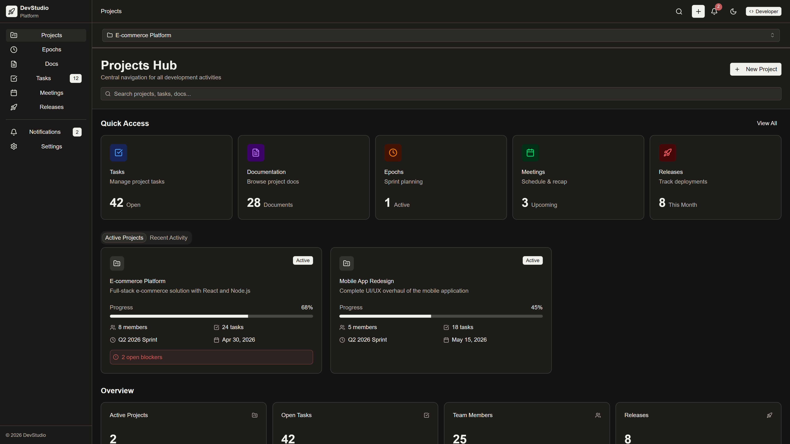
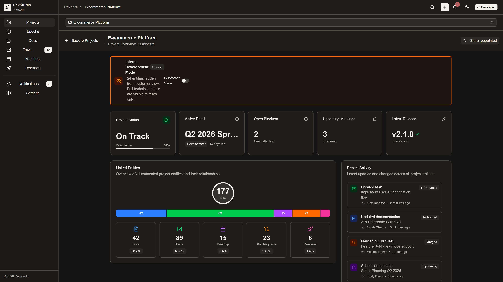
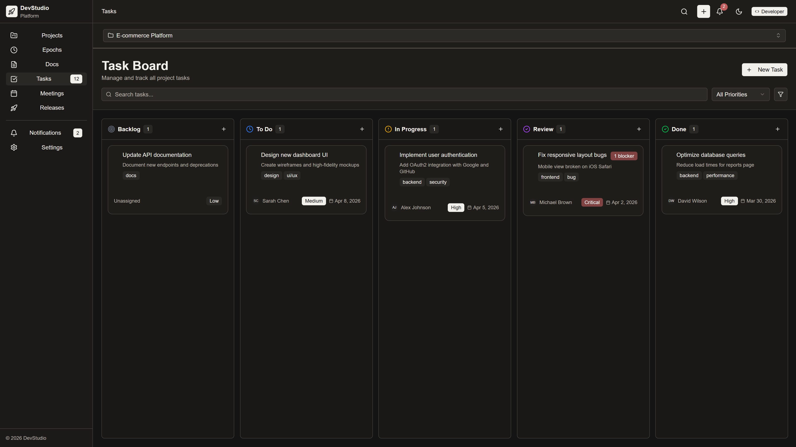
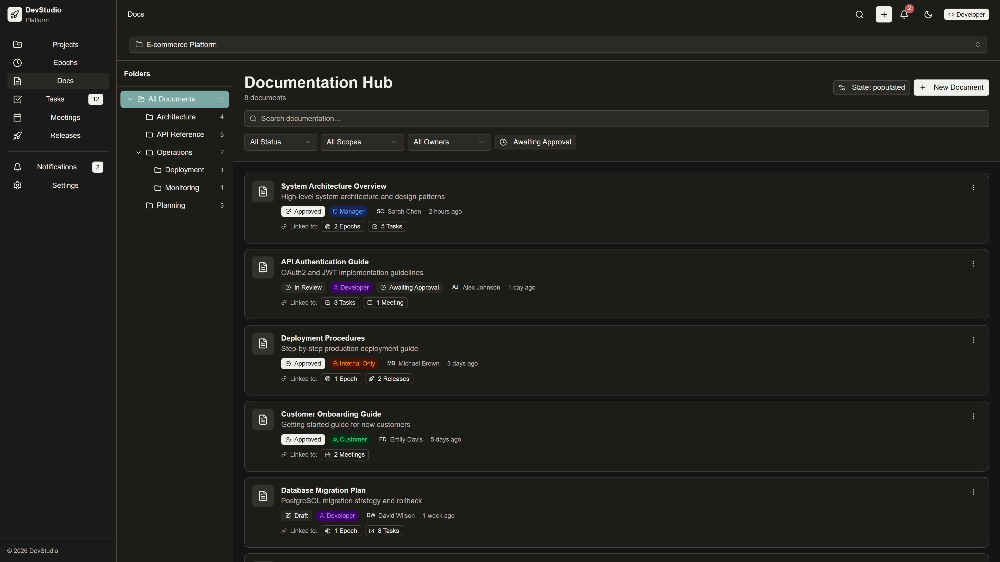
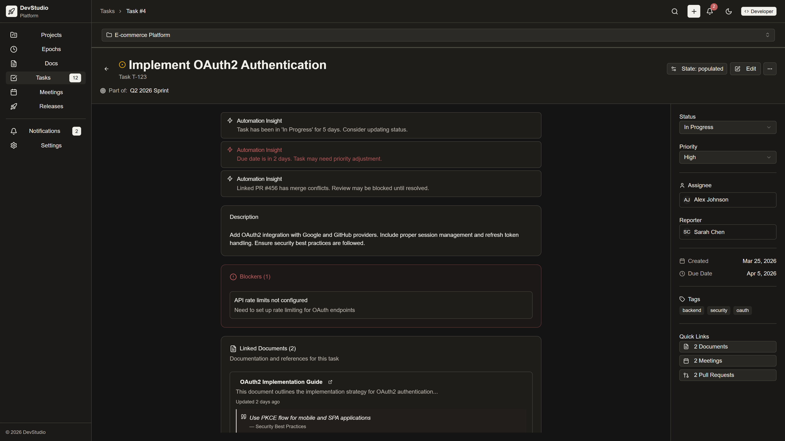
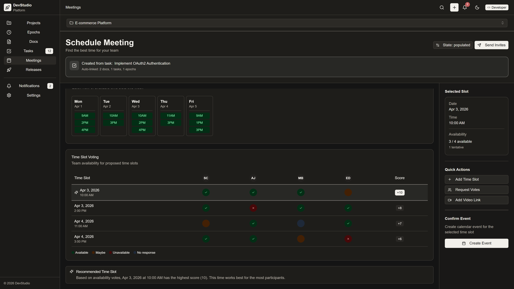

# Bezum Hack 2026

Хакатонный проект: frontend-прототип платформы для управления разработкой, где в одном интерфейсе связаны проекты, задачи, документация, встречи, релизы, pull request'ы и уведомления.

Проект сделан как демонстрация продуктовой идеи и пользовательских сценариев. Основной интерактивный прототип находится в папке `figma`; папка `frontend` содержит React/Vite-каркас, который можно использовать как основу для дальнейшего переноса прототипа в production-ready frontend.

## Скриншоты


### Список проектов



### Обзор проекта



### Kanban-доска



### Документы



### Карточка задачи



### Встречи



## Идея проекта

Во многих командах информация по проекту размазана между разными сервисами: задачи в task tracker, документация отдельно, встречи отдельно, релизы и pull request'ы отдельно. Из-за этого сложно быстро понять, почему задача появилась, какие документы к ней относятся, что обсуждали на встречах и в каком состоянии находится релиз.

Этот проект предлагает единую рабочую среду, где сущности связаны между собой:

- проект содержит эпохи/спринты, задачи, документы, встречи и релизы;
- задача может ссылаться на документы, встречи, pull request'ы и релиз;
- документ может иметь версии, согласование, комментарии и связи с задачами;
- встреча может быть привязана к задаче, документу, эпохе или проекту;
- уведомления собираются в единую inbox-ленту.

## Стек

### Frontend / Prototype

- React
- TypeScript
- Vite
- Tailwind CSS
- React Router
- Radix UI / shadcn-like components
- lucide-react
- TanStack Query
- Zod
- Playwright
- Vitest

### Backend / Infrastructure

- Go
- Gin
- PostgreSQL
- Redis
- RabbitMQ
- S3 / MinIO
- Docker
- Nginx

### ML-сервис

- Python
- FastAPI
- обработка записей встреч
- генерация summary по транскрипту

## Что реализовано в прототипе

В папке `figma` реализован интерактивный UI-прототип с основными экранами:

- список проектов;
- overview проекта;
- workspace эпохи/спринта;
- Kanban-доска задач;
- страница детальной информации по задаче;
- центр документации;
- редактор документа;
- история версий документа;
- планировщик встреч;
- итоги встречи;
- dashboard релизов и pull request'ов;
- unified inbox;
- настройки пользователя.

В прототипе используются mock-данные. Это значит, что интерфейс демонстрирует UX и продуктовые сценарии, но не все экраны подключены к реальному API.

## Структура проекта

```text
.
├── backend/              # Go backend: API, репозитории, сервисы, миграции
├── figma/                # основной интерактивный frontend-прототип
├── frontend/             # React/Vite frontend-каркас
├── ml/                   # ML-сервис для обработки встреч
├── nginx/                # конфигурация nginx
├── docker-compose.yml    # запуск figma-прототипа через Docker
```

## Как запустить figma-прототип

```bash
cd figma
npm install
npm run dev
```

После запуска Vite покажет локальный URL в терминале.

## Как собрать figma-прототип

```bash
cd figma
npm install
npm run build
```

## Запуск через Docker

Из корня проекта:

```bash
docker compose up --build
```

После запуска прототип будет доступен на:

```text
http://localhost:8080
```

## API-контракты

В `figma/contracts` лежат TypeScript-типы и OpenAPI-описание сущностей:

- Project
- Epoch
- Task
- Document
- Meeting
- Release
- PullRequest
- Notification
- User

Эти контракты можно использовать как основу для подключения frontend к backend API.
